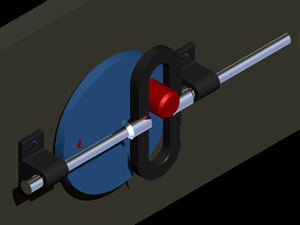

# Microservo-Robotic-Arm
Author: Jeremy Chan, Junzhe Chen

## Overview
This is a robotic arm made by using four $180^\circ$ microservos to achieve four degrees of freedom. It has a claw that can pick up small objects such as a pencil or a cloth. 

## 3D design process

### Designing the overall structure
Overall, we follows the rules below:
- The structure should be as light weight as possible, so that the microservo can handle the torque rather easily
- It should be easy to manufacture, i.e. easily 3D printable
- The arm should be long enough to have a relatively large working radius

Which the 2nd item conflict with the 3rd item. The best way we can sort this out is by using stronger microservo at the junction which handles large torque.

### Transferring rotation motion into linear motion
In one of our design. we want the claw to be able to pick up a round object such as a pencil. It will be hard to do for our first claw design which is basically two surfaces squeezing together. The cylindrical shape of a pencil will easily slip away from the claw. Also, the old design cannot pick up a cloth as it has big area of contact that will be difficult to "pinch" the cloth.

We decided to go with another design, which has three tips that will be squeeze together like a Doll clamping machine. However, one difficulties we has to face to is the claw design in the doll clamping machine opens and closes by pushing a rod inwards and outwards, which is a translational motion. For our microservo, it can only do a rotational motion, which cannot fit the requirement. They is something that has to be done to somehow transfer the rotational motion of the servo into linear motion to make the whole thing works.

To do that, we thought about using pinnion and gear. However, this will greatly increase the system complexity and it will be quite difficult to 3D print the structure. We can easily do it by machining metals, but it will make the whole structure much heavier which is against our 3D design philosophy mensioned earlier. We have come up with the solution that only projects $180^\circ$ rotation to the horizontal side of a circle. Sounds convoluting, here is a gif that might help!

## Arduino coding
We use the internal `servo.h` library to control the microservos. Every pins that has PWM output capability can be used as a servo pin. To attach a servo, it can be easily done by writing `servo.attach(pin number)` in the `setup()` function; To control the servo, we use `servo.write(angle)` to specify which angle we want the servo motor to be.

When it comes to linking the motion of the microservo with the knob. the way to do it is by reading the voltage from the potentiometer. As a standard Arduino Uno has 5 analog input pins, so it can attach maximum of 5 servo motors at once. 

The two sides of the potentiometer is connected to the ground and 5V, which the Arduino ADC will give the value between $0$ and $1023$ according to the voltage. However, the datasheet of the servomotor we have can only turn from $0^\circ$ to $180^\circ$, which writing a value of 1024 will cause some chaos to the microservo and we don't want it to happen. The way we solve it is by mapping the ADC readings from the potentiometer to the `servo.write()` value using the function `map()`.

## 3D printing
We will update the stl files that is ready to be imported into the slicer. Please notice some of our design have really thin frame (we specifically designed in this way to reduce the weight), it will be quite hard to print without any skirt and support. According to our test, adding skirt about 5 layers (or rafter) should do the job. If there is no skirt at the base and there is no glue applied, the base of the print might potentially fell off from the bed, result in printing a bunch of speghettis.